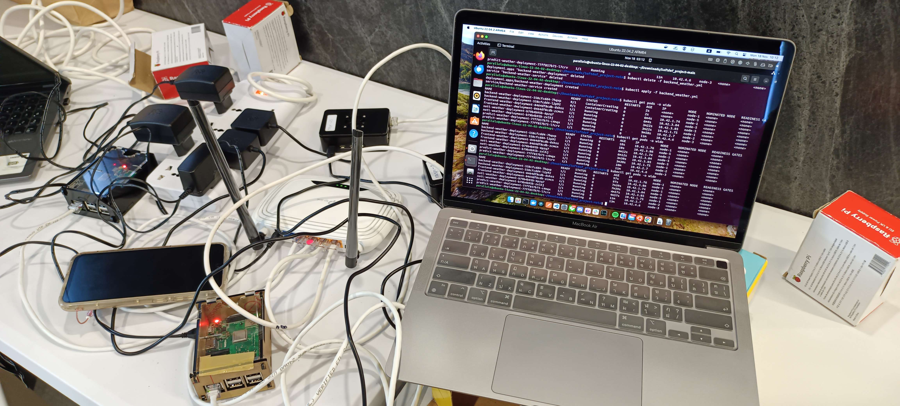

<div align="center">
	
	<p></p>
	
	
  
  <p></p>
  
  
  
  
</div>

# Temp Monitor

**Temp Monitor** is an open-source project designed for monitoring and managing temperature data efficiently. This repository contains multiple modular services for backend processing, logging, machine learning, and notification management.

## Features

- **Backend Service (`backend_svc`)**: 
  Handles core data processing and serves as the primary API for the system.
  
- **Logger Service (`logger_svc`)**: 
  Manages logs to track system activity and errors.
  
- **Machine Learning Service (`ml_svc`)**: 
  Provides predictive analytics and insights using temperature data.
  
- **Notification Service (`notification_svc`)**: 
  Sends alerts and notifications based on system thresholds and analysis.

## Tech Stack

- **Languages**: 
  - Python
  - Go
  - Shell
- **Tools**: 
  - Docker (for building images)
  - Kubernetes (for deployment and orchestration)

## Directory Structure
```
temp-monitor/ 
├── backend_svc/ # Backend service source code 
├── logger_svc/ # Logger service implementation 
├── ml_svc/ # Machine learning service implementation 
├── notification_svc/ # Notification service
├── deployment/ # Kubernetes manifests and management scripts
└── README.md # Project documentation
```

## Prerequisites

- [Docker](https://www.docker.com/) installed to build service images.
- [Kubectl](https://kubernetes.io/docs/tasks/tools/) configured for Kubernetes management.

## Setup

1. Clone the repository:
```bash
git clone https://github.com/naphatkps/temp-monitor.git
cd temp-monitor
```

2. Build Docker images for all services:
```bash
docker build -t weather_backend ./backend_svc
docker build -t weather_logger ./logger_svc
docker build -t weather_predict ./ml_svc
docker build -t weather_notification ./notification_svc
```

3. Install the ingress controller:
```bash
kubectl apply -f https://raw.githubusercontent.com/kubernetes/ingress-nginx/main/deploy/static/provider/cloud/deploy.yaml
```

4. Deploy the services and ingress using Kubernetes:
```bash
chmod +x ./deployment/manage_manifests.sh
./deployment/manage_manifests.sh apply
```

5. Access the services via the ingress.
```bash
http://localhost/backend
http://localhost/predict
http://localhost/logger
http://localhost/noti
```

## Contributing
We welcome contributions! To contribute:
1. Fork the repository.
2. Create a feature branch:
```bash
git checkout -b feature-name
```
3. Commit and push your changes:
```bash
git commit -m "Add feature-name"
git push origin feature-name
```
4. Submit a pull request for review.
## Contact
Naphat - naphat.kps@gmail.com

